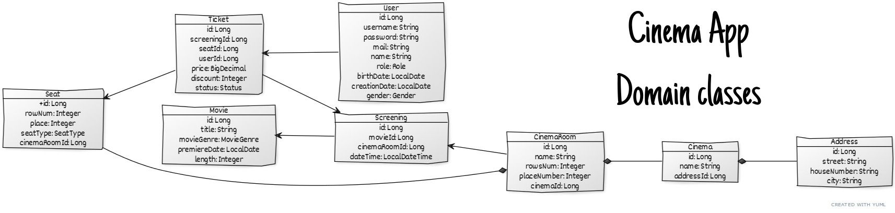

# Cinema App

Backend system for managing network of cinemas. It allows you to create cinemas with multiple rooms, movies, screenings and ticket bookings.
Data is stored in MySQL database, communication achieved with REST API (secured by JWT tokens)

## Security

If you want to perform create, update or delete operation (urls with "management") you need valid access token in HTTP Authorization header.  
You don't need authorization to create new user, but all other operations on users are allowed only to admins.  

You can get token with POST request to http://localhost:8080/login, in request body you must put Json with username and password of user having admin role.  
  
In sample data set admin user have login "AndiGross" and password "TurboAndi12.$". You can load sample data set with  GET request to http://localhost:8000/initializer.
You find prepared login request in postman collection (in main folder of project)




## Technology stack

- Java 16
- Spring framework
- Jdbi
- MySQL
- Spark web framework
- JWT
- Lombok
- Google Guava

Build tool: Maven

Docker (compose with two images - cinema-app and mysql)

Testing: Junit 5, AssertJ, Mockito


## Installation and starting


What you need: Java 16, Maven, Docker

After downloading of source files, project must be compiled to jar file with command "mvn clean install".
Whole environment (app + MySQL database) is build with docker compose with command:

- docker compose up -d --build

By starting of containers main class App is launched and API under port 8000 available (see API reference).   
Sample data can be loaded to database with GET request to http://localhost:8000/initializer.


## API Reference

### Cinema

#### Create new cinema

```http
  POST /cinemas/management
```

Request body - CreateUpdateCinemaDto - contains all data needed to create new cinema


#### Find cinemas by city

```http
  GET /cinemas/city/:city
```

| Parameter | Type     | Description                           |
| :-------- | :------- | :--------------------------------     |
| `:city`   | `string` | **Required**. Name of city to search  |

#### Find cinema by name

```http
  GET /cinemas/name/:name
```

| Parameter | Type     | Description                             |
| :-------- | :------- | :--------------------------------       |
| `:name`   | `string` | **Required**. Name of cinema to search  |


#### Find all cinemas

```http
  GET /cinemas
```

### Screenings

#### Create new screening

```http
  POST /screenings/management
```

Request body - CreateUpdateScreeningDto - contains all data of screening to create


#### Update existing screening

```http
  PUT /screenings/management/:id
```

Request body - CreateUpdateScreeningDto - contains all data of screening to update

| Parameter | Type     | Description                              |
| :-------- | :------- | :--------------------------------        |
| `:id`     | `string` | **Required**. Id of screening to update  |  

#### Delete screening

```http
  DELETE /screenings/management/:id
```

Request body - CreateUpdateScreeningDto - contains all data of screening to update

| Parameter | Type     | Description                              |
| :-------- | :------- | :--------------------------------        |
| `:id`     | `string` | **Required**. Id of screening to delete  |  

#### Find all screenings

```http
  GET /screenings
```

#### Find screenings by keyword

```http
  GET /screenings/:keyword
```

Searching in all screenings by given keyword. Searched is by cinema name, cinema room's name, city, street, or movie's titles.

| Parameter | Type     | Description                       |
| :-------- | :------- | :-------------------------------- |  
| `:keyword`| `string` | **Required**. Keyword to find     |


#### Find screenings by date

```http
  GET /screenings/date/:date
```

Searching all screening from given date.

| Parameter | Type     | Description                       |
| :-------- | :------- | :-------------------------------- |  
| `:date    | `string`    | **Required**. Date to find     |


#### Find screenings by date and cinema

```http
  GET /screenings/:cinema/:date
```

Searching all screening from given date and cinema

| Parameter | Type     | Description                       |
| :-------- | :------- | :-------------------------------- |  
| `:cinema` | `string` | **Required**. Cinema to find      |
| `:date`   | `string` | **Required**. Date to find        |

### Users

#### Create new user

```http
  POST /users/creator
```

Request body - CreateUpdateUserDto - contains all data of user to create


#### Update existing user

```http
  PUT /users/:id
```

Request body - CreateUpdateUserDto - contains all data of user to update

| Parameter | Type     | Description                         |
| :-------- | :------- | :--------------------------------   |
| `:id`     | `string` | **Required**. Id of user to update  |  


### Delete user

```http
  DELETE /users/:id
```


| Parameter | Type     | Description                              |
| :-------- | :------- | :--------------------------------        |
| `:id`     | `string` | **Required**. Id of user to delete       |  

#### Find all users

```http
  GET /users
```

#### Find user by username

```http
  GET /users/:username
```

| Parameter | Type     | Description                       |
| :-------- | :------- | :-------------------------------- |  
| `:username`| `string` | **Required**. Username to find   |


#### Find user by mail

```http
  GET /users/:mail
```

| Parameter | Type     | Description                       |
| :-------- | :------- | :-------------------------------- |  
| `:mail`| `string`    | **Required**. mail to find        |

### Movies

#### Create new movie

```http
  POST /movies/management
```

Request body - CreateUpdateScreeningDto - contains all data of movie to create


#### Update existing movie

```http
  PUT /movies/management/:id
```

Request body - CreateUpdateMovieDto - contains all data of movie to update

| Parameter | Type     | Description                         |
| :-------- | :------- | :--------------------------------   |
| `:id`     | `string` | **Required**. Id of movie to update |  


### Delete movie

```http
  DELETE /movies/management/:id
```


| Parameter | Type     | Description                              |
| :-------- | :------- | :--------------------------------        |
| `:id`     | `string` | **Required**. Id of movie to delete      |  

#### Find all movies

```http
  GET /movies
```

#### Find movie by title

```http
  GET /movies/:title
```

| Parameter | Type     | Description                       |
| :-------- | :------- | :-------------------------------- |  
| `:title`| `string`   | **Required**. Title to find       |


#### Find movies by genre

```http
  GET /movies/:genre
```

| Parameter | Type     | Description                       |
| :-------- | :------- | :-------------------------------- |  
| `:genre`| `string`    | **Required**. genre to find      |


### Tickets

#### Create new ticket

```http
  POST /tickets/management
```

Request body - CreateUpdateTicketDto - contains all data of ticket to create


#### Update status of existing ticket

```http
  PUT /tickets/management/:id/:status
```


| Parameter | Type     | Description                              |
| :-------- | :------- | :--------------------------------        |
| `:id`     | `string` | **Required**. Id of ticket to update     |  
| `:status` | `string` | **Required**. Status of ticket to update |  


### Delete ticket

```http
  DELETE /tickets/management/:id
```


| Parameter | Type     | Description                             |
| :-------- | :------- | :--------------------------------       |
| `:id`     | `string` | **Required**. Id of ticket to delete    |  


#### Getting map with seats with reservations of given screening

```http
  GET /tickets/bookings/:id
```

| Parameter | Type     | Description                       |
| :-------- | :------- | :-------------------------------- |  
| `:id`     | `string`   | **Required**. Screening to find |


  